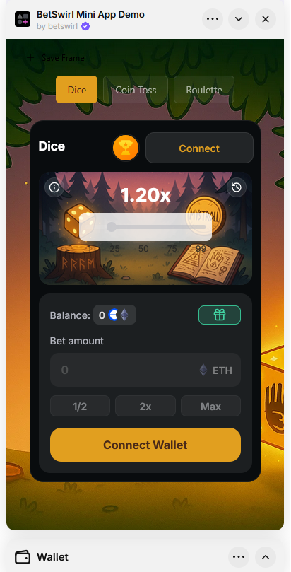

import Image from 'next/image'
import { Callout } from 'nextra/components'

# Launch Your Farcaster Mini App in Under 1 Hour 🚀

Ready to launch your own casino mini app on Farcaster? With BetSwirl, you can go from zero to live in **less than 1 hour** - no matter your technical background!

**Check out our live demo:** [BetSwirl Mini App Demo](https://farcaster.xyz/miniapps/M926rOlymYrS/betswirl-mini-app-demo)

## Who Can Build This?

**Non-developers:** Perfect! Our step-by-step guide makes it easy. You'll fork a repository, configure a few settings, and deploy. We're here to help you every step of the way.

**Developers:** Even better! You'll have full control to customize the app, add your branding, configure games, and integrate additional features. The foundation is ready - you just need to make it yours.

## What You'll Get

- ✅ Multi-game casino (Dice, Coin Toss, Roulette, and more)
- ✅ Multi-chain support (Base, BSC, Arbitrum, and more)
- ✅ Custom branding and theming
- ✅ Freebet system integration
- ✅ Leaderboards
- ✅ Fully functional Farcaster Mini App

## Get Started

Ready to build? Follow our complete guide:

**[→ Full Integration Guide](/developer-hub/demos/ui-react/miniapp)**

The guide walks you through:
- Setting up your project (fork or from scratch)
- Configuring your mini app manifest
- Adding BetSwirl games
- Customizing your branding
- Deploying to Vercel
- Publishing on Farcaster

**Time to complete:** ~1 hour

<Callout type="info">
  Need help? We're here to support you! Join our dev communities:
  
  - **Telegram**: [@BetSwirl Affiliates](https://t.me/betswirl_affiliates)
  - **Farcaster**: [BetSwirl Group](https://farcaster.xyz/~/group/jPeBSyuWaPi3YKOBxb7gSQ)
</Callout>
